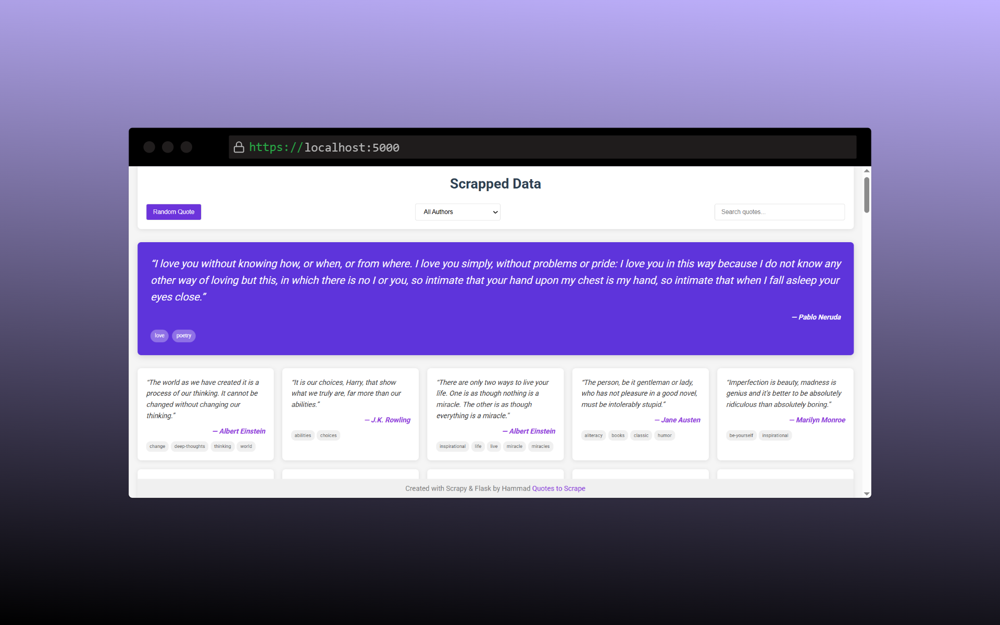

# Quotes Explorer



A web scraping and visualization project that extracts quotes from [Quotes to Scrape](http://quotes.toscrape.com/) and displays them in an interactive web application.

## 🚀 Features

- **Web Scraping**: Extract quotes, authors, and tags using Scrapy
- **Interactive Frontend**: Explore and filter quotes through a clean, modern interface
- **Random Quote Generator**: Display a random inspirational quote
- **Author Filtering**: Filter quotes by specific authors
- **Search Functionality**: Search quotes by text, author, or tags
- **Responsive Design**: Works on desktop and mobile devices

## 🛠️ Technologies Used

- **Backend**: 
  - Python 3.x
  - Scrapy (web scraping framework)
  - Flask (web application framework)
  
- **Frontend**:
  - HTML5/CSS3
  - JavaScript (Vanilla)
  - Google Fonts

- **Package Management**:
  - UV (fast Python package installer)


## 🔧 Installation

1. **Clone the repository**
    ```bash
    git clone https://github.com/yourusername/quotes-explorer.git
    cd quotes-explorer
    ```

2. **Set up a virtual environment using UV**
    ```bash
    pip install uv
    uv venv
    source .venv/Scripts/activate  # Windows with Git Bash
    # OR on Linux/macOS: source .venv/bin/activate
    ```

3. **Install dependencies**
    ```bash
    uv pip install -r requirements.txt
    ```

## 🕷️ Running the Scraper

1. **Activate your virtual environment**
    ```bash
    source .venv/Scripts/activate  # Windows with Git Bash
    # OR on Linux/macOS: source .venv/bin/activate
    ```

2. **Run the spider to collect quotes**
    ```bash
    scrapy crawl quotes -o quotes.json
    ```

## 🌐 Running the Web Application

1. **Navigate to the frontend directory**
    ```bash
    cd frontend
    ```

2. **Start the Flask application**
    ```bash
    python app.py
    ```

3. **Open your browser**
    
    Navigate to [http://127.0.0.1:5000/](http://127.0.0.1:5000/) to view the application.

## 🖼️ Screenshot


The application features:
- A beautiful purple-themed interface
- Featured quote section displaying random quotes (shown: Pablo Neruda quote)
- Quote cards from diverse authors including Albert Einstein, J.K. Rowling, Jane Austen, and Marilyn Monroe
- Tag chips for easy categorization
- Filtering options via dropdown and search box

## 🔍 How to Use the Application

1. **View all quotes** on the main page in a card-based layout
2. **Click the "Random Quote" button** to display a new featured quote
3. **Filter quotes by author** using the dropdown menu
4. **Search for specific quotes** by entering text in the search box
5. **Hover over quote cards** to see a subtle animation effect

## 🧩 Extending the Project

### Adding More Spiders
To scrape different websites, create new spiders in the `scrappy_showcase/spiders/` directory:

```bash
cd scrappy_showcase
scrapy genspider example example.com
```

### Enhancing the Frontend
The frontend can be extended with:
- Data visualizations (charts showing quote distribution)
- User authentication for saving favorite quotes
- Dark mode toggle
- Export functionality for filtered quotes

## 🙏 Acknowledgments

- [Quotes to Scrape](http://quotes.toscrape.com/) for providing the test website
- [Scrapy](https://scrapy.org/) for the powerful web scraping framework
- [Flask](https://flask.palletsprojects.com/) for the web application framework

---

*Note: Before using this project, make sure to check if web scraping is allowed for your target website and respect robots.txt rules.*
